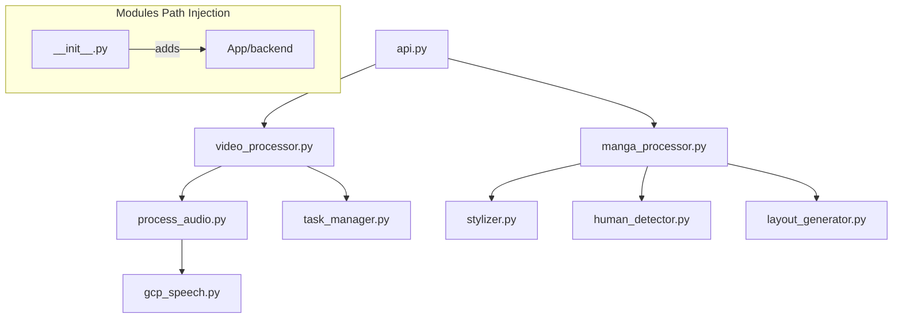

# Vid2Manga: Project Blueprint

## Project Introduction

Vid2Manga is an automated pipeline designed to transform video content into professionally styled manga pages. The system integrates advanced computer vision for frame selection and stylization with speech-to-text processing for dialogue extraction and speaker diarization.

## Final Purpose

To provide a seamless, end-to-end tool that converts various video formats (including web content from platforms like YouTube) into readable manga layouts, retaining the narrative flow through synchronized speech breakdown and character-aware visual processing.

---

## Technical Stack

- **Backend**: FastAPI (Python 3.12+)
- **Frontend**: React + Vite (Dark Mode UI)
- **Computer Vision**: OpenCV, Pillow, Mask2Former (Transformers)
- **Speech**: OpenAI Whisper, GCP Speech-to-Text (Diarization)
- **Audio/Video**: FFmpeg

---

## Tasks Breakdown

*This section provides a high-level roadmap of development priorities (to be updated manually).*

### Phase 1: Core Infrastructure

- [X] Backend modularization and service relocation.
- [X] Application path unification (`settings.INPUT_DIR`).
- [X] Basic Speech-to-Text pipeline (local + GCP).

### Phase 2: Visual & Artistic Processing

- [ ] Refine stylization filters (A/B/C).
- [ ] Improve character-aware layout segmentation.
- [ ] Optimize manga page composition performance.

### Phase 3: Speech & Interaction

- [X] Implement speaker diarization interface.
- [X] Integrate local diarization model (**pyannote-audio v3.1**).
- [X] Implement standalone offline zero-shot diarization (**ECAPA-TDNN**).
- [ ] Interactive timeline/audio playback sync.

---

## Future Assessment Requirements

*These requirements MUST be ensured at the start of any future assessment or coding session.*

1. **Environment Activation**: Always verify and activate the correct environment (e.g., `conda activate only_env`) before running tests or performing inference, as it contains heavy dependencies like `torch` and `pyannote-audio`.
2. **Mocking Policy**: When writing or updating tests, always mock heavy ML models (Whisper, Mask2Former, Pyannote) to ensure fast and deterministic CI/CD cycles.
3. **Path Consistency**: Ensure all new modules use `settings.INPUT_DIR` and `settings.OUTPUT_DIR` to maintain Windows/Linux cross-compatibility.
4. **Documentation Sync**: Update `GEMINI.md` after any change to function signatures or project structure.
5. **Sanitization**: Stictly enforce "No Emojis" and "No Special Characters" in all code and commits.
6. **Orientation**: Before you execute something, read this `GEMINI.md` file first to get a grasp of what is in the codebase and what has been done so far.
7. **Log Unification**: After each 5 new changes, concat the logs into 1 unified one with consistent information flow.

---

## Project Structure

### 1. Root Configuration

- `GEMINI.md`: (This file) Project overview and developer guide.
- `README.md`: High-level summary and usage instructions.
- `.env`: Environment variables (API keys, model toggles).

- `.gitignore`: Workspace-aware patterns for inputs, outputs, and local models.

### 2. Core Modules (`/modules`)

This directory contains the heavy-lifting logic, decoupled from the API layer.

#### `/modules/frame` (Visual Processing)

- **`video_processor.py`**:
  - `process_video(file: UploadFile)`: Main entry point for synchronous video processing. Saves the upload, triggers audio/video splitting, and runs a transcription preview.
  - `process_video_task(task_id: str, ...)`: Background task handler that orchestrates audio extraction, video-only stripping, and full transcription with segmentation. Updates task status and stores final results.
  - *Imports*: `modules.speech.process_audio`, `core.config`, `task_manager`.
- **`manga_processor.py`**:
  - `draw_masks(image_np: np.ndarray, masks: list, ...)`: Helper to composite binary segmentation masks onto an image for visualization.
  - `process_manga_generation(image_paths: list, ...)`: The master pipeline for converting a list of raw images into a multi-page manga. Orchestrates stylization, optional human segmentation, layout generation, and final page compositing.
  - *Imports*: `stylizer`, `layout_generator`, `human_detector`, `core.config`.
- **`stylizer.py`**:
  - `frame_clear(image_path: str, ...)`: Validates image quality by checking for excessive blur or low brightness.
  - `stylize_a`, `stylize_b`, `stylize_c`: Implementation of three distinct artistic filters:
    - **A**: Classic Black & White Manga (**Contrast Limited Adaptive Histogram Equalization (CLAHE)** + **Adaptive Thresholding**).
    - **B**: Anime-style Coloring (**Iterative Bilateral Filter** + **Median Blur Edges**).
    - **C**: Comic book effect (**Edge-Preserving Smoothing** via `cv2.edgePreservingFilter`).
  - `cv2_to_pil(cv2_image: np.ndarray)`: Utility to convert OpenCV images to PIL format for compositing.
  - `create_manga_pipeline(...)`: A standalone test pipeline for image processing.
- **`human_detector.py`**:
  - `PersonSegmenter`: Class wrapper responsible for loading and running the **Mask2Former** universal segmentation model (`qubvel-hf/finetune-instance-segmentation-ade20k-mini-mask2former`).
  - `load()`: Lazy-loads the Hugging Face transformer model and processor to the optimized device (CUDA/CPU).
  - `segment(image_path: str, ...)`: Performs inference to extract binary masks of person instances from a given frame.
- **`layout_generator.py`**:
  - `generate_manga_layout(width, height, num_frames, ...)`: Implements a **Recursive Binary Splitting Tree** algorithm to generate ordered rectangular frames for a manga page. Prioritizes splitting areas with extreme aspect ratios.
  - `create_manga_page(images, frames, ...)`: Composites processed images into the generated layout using Pillow **LANCZOS Resampling**.
  - `create_bubble_mask(image_shape, axes, ...)`: Heuristic-based algorithm to find optimal placement for speech bubbles. Uses **Template Matching** (`cv2.matchTemplate`) with **Cross-Correlation** and a **Euclidean Distance Penalty** to avoid character overlap.
- **`bubble_processor.py`**:
  - `Bubble`: Utility class for advanced bubble manipulation.
  - `get_bubble_mask(image, ...)`: Extracts a binary mask of a speech bubble from a frame.
  - `segment_bubble(mask)`: Uses **Distance Transform** and **Morphological Opening/Dilation** to split a bubble mask into its "body" and "tail".
  - `extract_biggest_polygon(mask)`: Simplifies custom bubble shapes into polygonal approximations using the **Approximate Polygonal DP (Douglas-Peucker) Algorithm**.
  - `decompose_bubble(image)`: Full suite utility to break down a bubble into its geometric components.
  - `reattach_tail(body_mask, tail_mask, angle_deg)`: Rotates and re-attaches a bubble tail at a custom angle using **Affine Transformations** (Translation/Rotation) and **Image Centroids**.
  - `typeset_text(image, text, ...)`: Automatically fits and centers dialogue inside a bubble mask using **Mask Erosion** for padding and **Iterative Font Scaling**.
  - `calculate_relative_angle(from_mask, to_mask)`: Calculates the geometric angle between mask centroids for automated tail alignment.

#### `/modules/speech` (Audio Processing)

- **`process_audio.py`**:
  - `split_video_audio(input_file: str)`: Uses **FFmpeg** to extract mono 16kHz audio (WAV) and a soundless video (MP4) from a source file.
  - `_transcribe_whisper(audio_path: str, ...)`: Performs local transcription using the **OpenAI Whisper "base"** model, now features local speaker diarization fallback.
  - `_assign_speakers(...)`: Helper to merge diarization segments with transcription data based on temporal overlap.
  - `speech2text(audio_file: str, ...)`: High-level orchestration that selects the correct engine (GCP with Whisper fallback) based on environment configuration.
- **`ecapa_tdnn.py`**:
  - `PretrainedECAPATDNN`: Standalone PyTorch wrapper that lazy-loads and extracts 192-dimensional normalized speaker embeddings using official checkpoints.
- **`diarization.py`**:
  - `LocalDiarizer`: Zero-shot offline speaker diarizer using pre-trained ECAPA-TDNN and Agglomerative Hierarchical Clustering (AHC) with dynamic speaker count estimation.
- **`gcp_speech.py`**:
  - `resolve_credentials_path()`: Dynamically resolves the absolute path to Google Cloud service account JSON keys.
  - `transcribe_gcp(audio_path: str, ...)`: High-precision transcription service using the **Google Cloud Speech-to-Text API v1**, featuring full **Speaker Diarization** (clustering logic) and word-level timestamps.

#### `/modules` (Base)

- **`task_manager.py`**:
  - `Task`, `TaskStatus`, `Result`: Definitions for background job state management.

---

### 3. Application Components (`/App`)

#### `/App/backend` (Service Layer)

- **`main.py`**: FastAPI app setup, CORS configuration, and `/output` static mounting.
- **`api/v1/api.py`**:
  - `@router.post("/api/convert")`: Video upload endpoint.
  - `@router.get("/api/status/{id}")`: Task polling endpoint.
  - `@router.post("/api/manga-layout")`: Direct image-to-manga endpoint.
- **`core/config.py`**: Central `Settings` class for path resolution (`BASE_DIR`, `INPUT_DIR`, `OUTPUT_DIR`).
- **`schemas/video.py`**: Pydantic models for API responses (`VideoResponse`, `SpeechSegment`).

#### `/App/frontend` (User Interface)

- **`src/components/VideoUpload.jsx`**: Logic for file selection, language choosing, and task polling.
- **`src/config.js`**: Dynamic API configuration supporting `VITE_API_BASE_URL`.
- **`src/components/ResultDisplay.jsx`**: Visualizer for result media and the **Speech Breakdown** interface.
- **`src/css/TextResult.css`**: Styling for the interactive timeline and hover states.

---

## File Connections & Import Flow

## Mandatory Coding Standards

### 1. Code Hygiene & Comments

- **Clean First**: Always clean the code before making changes.
- **Sectional Comments**: Use only sectional comments to divide logic blocks.
- **No Ordering**: Do not use numbered (`1.`, `2.`) or lettered (`a)`, `b)`) lists in comments.
- **Line Comments**: Only use line comments if a specific line is exceptionally complex or non-obvious.

### 2. Documentation (Docstrings)

- **Mandatory for All Functions**: Every function MUST have a Google-style or similar docstring.
- **Overall Purpose**: A brief description of what the function does.
- **Input Params**: `param_name: dtype` - Description of the parameter.
- **Output**: `dtype` - Description of the return value.

### 3. Text & Output Sanitization

- **No Emojis**: Never use emojis in code, console logs, print statements, or comments.
- **No Special Characters**: Avoid unusual Unicode characters in technical logs or comments.

### 4. Maintenance

- **Update GEMINI.md**: This file MUST be updated immediately after any code refinement that changes functionality, structure, or function signatures.

---

## Key Developer Notes

- **Paths**: Always use `settings.INPUT_DIR` or `settings.OUTPUT_DIR` to ensure Windows compatibility and workspace consistency.
- **API Configuration**: The frontend uses `import.meta.env.VITE_API_BASE_URL` with a fallback to `http://localhost:8000/api`. The backend router is prefixed with `/api` in `main.py`.
- **Background Tasks**: All media processing happens asynchronously via `BackgroundTasks` in FastAPI. Check current status via `/api/status/{id}`.
- **Speech Breakdown**: The UI expects `segments` in the result object, which include `speaker` name and `text` content. Whisper results currently default to 'Unknown Speaker'.

---

## Development Log

- **Premium Visual Redesign: 2026-05-30**
  - Refactored global App CSS with unified Ink and Crimson screentone variables, responsive workbench grids, and tactile button animations.
  - Redesigned Home page into an asymmetric split panel layout utilizing a custom LCP value proposition and a grid-wide bento showcase.
  - Upgraded Video Converter to a 50/50 split Workbench layout with dynamic loading status logs and detailed extraction progress states.
  - Stylized Manga Generator dashboard and canvas rendering viewport with high-contrast borders and character-aware parameter fields.

- **Zero-Shot Speaker Diarization: 2026-05-27**
  - Designed and built a standalone, pure PyTorch ECAPA-TDNN model (`ecapa_tdnn.py`) with SpeechBrain checkpoint state-dict dynamic mapping.
  - Implemented offline zero-shot speaker diarization in `diarization.py` using AHC clustering, dynamic VAD, and dynamic speaker estimation.
  - Removed dependencies on pyannote-audio and speechbrain for seamless local execution on Windows/Linux.
  - Resolved Windows platform audio saving constraints by integrating the standard soundfile library.

- **Visuals & Logic Update: 2026-04-15**
  - Resolved "out of the black box" layout issue in Manga Generator UI by implementing `minmax(0, ...)` grid constraints and `width: fit-content` background cards.
  - Implemented `calculate_relative_angle` in `bubble_processor.py` for dynamic character-aware bubble tail orientation.
  - Optimized viewport scaling for generated manga pages using `max-height` constraints for improved readability.

### Previous Status: 2026-04-14 (Unified Update)
- Successfully decoupled core logic into the root-level `modules/` directory.
- Centralized path resolution using `settings.INPUT_DIR` and `settings.OUTPUT_DIR`.
- Integrated local speaker diarization using `pyannote/speaker-diarization-3.1`.
- Upgraded "Speech Breakdown" UI with interactive timestamp jumps and speaker awareness.
- Resolved `ffmpeg` encoding issues on Windows and improved `bubble_processor.py` robustness.
