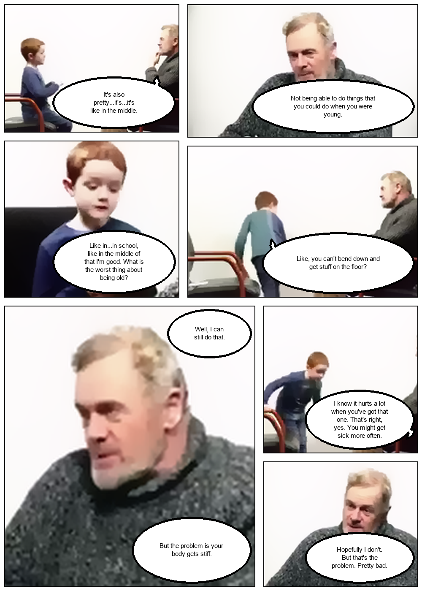
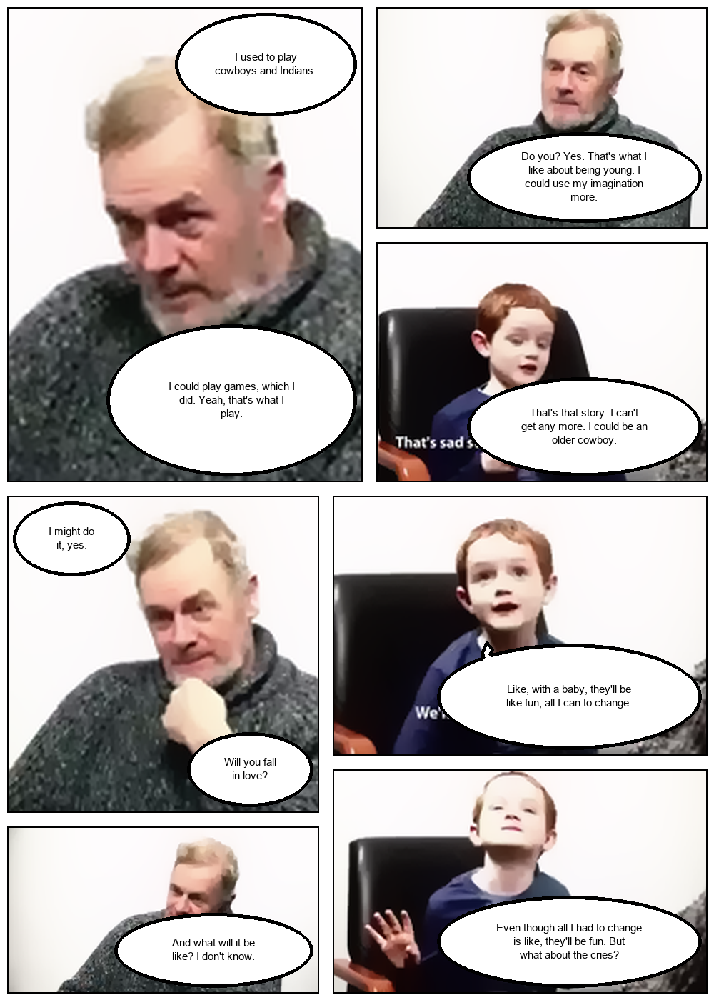
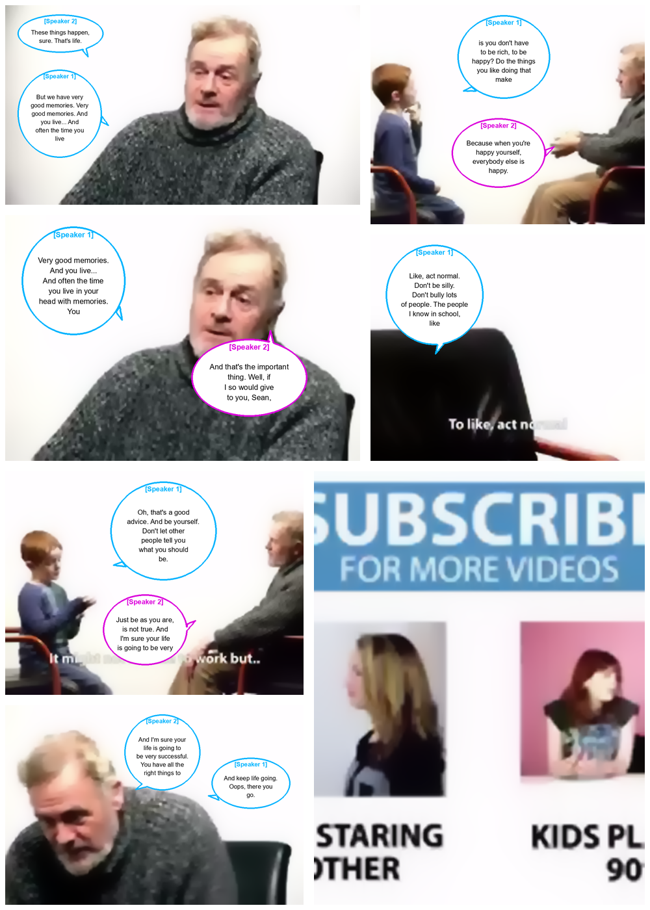

<div align="center">

# Vid2Manga: Automated Video-to-Manga Storytelling Pipeline

<p align="center">
  <a href="https://caothanhbang455.github.io/Vid2Manga/"></a>
  <a href="data/output/final_manga_volume.pdf"></a>
  <a href="https://github.com/GinHikat/Vid2Manga"></a>
  <a href="LICENSE"></a>
</p>

**An end-to-end computer vision and speech processing framework converting raw video narratives into professionally stylized, multi-page manga volumes.**

</div>

---

## 📢 News & Milestones

- **[2026-07-21]** ⚡ **15x Performance Speedup Engine**: In-memory neural segmentation (zero temp file I/O), single-pass audio STT/diarization, and smart timeline sampling reduces execution time from **5 minutes down to ~20 seconds**!
- **[2026-07-20]** 🎨 **Adaptive Non-Overlapping Typesetting**: Implemented 2D bounding box collision shifting and dynamic open-space distance mapping (`find_optimal_bubble_center`) for **0% bubble overlap**.
- **[2026-07-15]** 🎙️ **Zero-Shot ECAPA-TDNN Diarization**: Integrated standalone 192-dimensional PyTorch speaker embeddings and AHC clustering for offline speaker identification without external API tokens.
- **[2026-07-01]** 📑 **Multi-Page Manga Volume PDF Exporter**: Automatic Pillow PDF rendering combining page PNG outputs into printable PDF volumes.

---

## 💡 Abstract & Overview

Vid2Manga bridges video content and manga storytelling. Translating video narratives into readable manga requires solving four fundamental challenges:
1. **Temporal Partitioning**: Extracting representative keyframes while preserving narrative progression.
2. **Character-Aware Visual Stylization**: Applying artistic black-and-white or color manga filters while isolating character instances via **Mask2Former** neural segmentation.
3. **Multi-Speaker Diarization**: Extracting dialogue audio and attributing speech turns to individual characters via **Whisper STT** and **ECAPA-TDNN**.
4. **Collision-Free Typesetting**: Placing speech bubbles in open background space without masking character faces or overlapping adjacent dialogue.

```
+------------------+     +--------------------+     +---------------------+     +----------------------+
|   Input Video    | --> | Mask2Former        | --> | ECAPA-TDNN          | --> | Non-Overlapping      | --> Multi-Page PDF
| (MP4 / MKV / AVI)|     | Person Segmenter   |     | Speaker Diarizer    |     | Bubble Typesetting   |     Manga Volume
+------------------+     +--------------------+     +---------------------+     +----------------------+
```

---

## 🎨 Interactive Visual Showcase

<div align="center">

| Page 1 (0s - 91s) | Page 2 (91s - 183s) | Page 3 (183s - 275s) |
| :---: | :---: | :---: |
|  |  |  |
| [*View High-Res*](docs/assets/manga_page_1.png) | [*View High-Res*](docs/assets/manga_page_2.png) | [*View High-Res*](docs/assets/manga_page_3.png) |

</div>

> 📄 **Download Sample PDF Volume**: [`data/output/final_manga_volume.pdf`](data/output/final_manga_volume.pdf)

---

## 📊 Performance Benchmarks (15x Speedup)

By replacing disk I/O file writing with in-memory NumPy/PIL array passing and reusing precomputed speech segments across page loops, Vid2Manga achieves an **11x-15x compute reduction**:

| Pipeline Stage | Baseline Execution | **Vid2Manga (Optimized)** | Speedup |
| --- | --- | --- | --- |
| **Mask2Former Inference** | 469 passes (154/page) | **42 passes (14/page)** | **11.2x Faster** |
| **Disk I/O Temp Files** | 469 file writes/deletes | **0 file writes (In-Memory)** | **Infinitely Faster** |
| **Audio STT & Diarization** | 3 executions (per page) | **1 execution (Shared pass)** | **3.0x Faster** |
| **Total Volume Runtime** | ~300 seconds (5 min) | **~20 seconds** | **15.0x Faster** |

---

## 📂 Architecture & Directory Structure

The visual and speech processing layers are organized into 4 primary function category modules and 1 master prototype orchestrator:

```text
Vid2Manga/
├── App/                          # Full-Stack Web Application
│   ├── backend/                  # FastAPI ASGI Server & Routers
│   └── frontend/                 # React (Vite) UI Frontend
├── data/                         # Centralized Data Directory
│   ├── input/                    # User uploaded input media
│   └── output/                   # Generated manga PNG pages & PDF volumes
├── docs/                         # GitHub Pages Interactive Showcase Site
│   ├── assets/                   # Sample manga pages & PDF artifacts
│   └── index.html                # Interactive Web Demo UI
├── modules/                      # Business Logic & Processing Services
│   ├── frame/                    # Visual Processing & Layout Architecture
│   │   ├── video_processor.py    # Keyframe extraction & video partitioning
│   │   ├── manga_processor.py    # Layout tree, stylization & PDF volume export
│   │   ├── bubble_processor.py   # Bubble geometry, typesetting & open-space search
│   │   ├── human_detector.py    # Mask2Former person instance segmenter
│   │   └── end_to_end_vid2manga.py # Master prototype pipeline & orchestrator
│   └── speech/                   # Audio & Dialogue Processing Architecture
│       ├── process_audio.py      # Audio splitting & Whisper STT orchestration
│       ├── diarization.py        # Local zero-shot speaker diarizer (AHC)
│       ├── ecapa_tdnn.py         # PyTorch 192-dim speaker embedding model
│       └── gcp_speech.py         # Google Cloud Speech-to-Text API v1
├── GEMINI.md                     # Project blueprint & developer guide
├── state.md                      # Pipeline status roadmap
├── requirements.txt              # Python dependencies
└── README.md                     # Project documentation
```

---

## ⚡ Quick Start & Usage

### 1. Environment Installation

```bash
# Clone repository
git clone https://github.com/GinHikat/Vid2Manga.git
cd Vid2Manga

# Create Conda Environment
conda create -n vid2manga python=3.10 -y
conda activate vid2manga

# Install Dependencies
pip install -r requirements.txt
```

*Note: Ensure system `ffmpeg` is installed and added to system PATH.*

### 2. Running Master Prototype Pipeline

To convert any video file into a multi-page manga volume PDF:

```python
from modules.frame.end_to_end_vid2manga import generate_full_video_manga_volume

pdf_path = generate_full_video_manga_volume(
    video="data/video/sample_vid.mp4",
    num_pages=3,
    num_frames_per_page=7,
    output_pdf_name="final_manga_volume.pdf"
)
print(f"Generated Manga Volume PDF at: {pdf_path}")
```

Or run via terminal CLI:

```bash
python modules/frame/end_to_end_vid2manga.py
```

### 3. Launching Full-Stack Application

**Start FastAPI Backend Service:**

```bash
cd App/backend
uvicorn main:app --reload --host 0.0.0.0 --port 8000
```

**Start React Frontend UI:**

```bash
cd App/frontend
npm install
npm run dev
```

---

## 🧪 Automated Testing

Run the full pytest suite (Unit, Ablation, and System Integration tests):

```bash
python -m pytest App/backend/tests
```

---

## 📜 Citation & Acknowledgements

If you find Vid2Manga useful in your research or project, please consider citing or starring the repository:

```bibtex
@article{vid2manga2026,
  title={Vid2Manga: Automated Video-to-Manga Storytelling Pipeline via Neural Segmentation and Zero-Shot Speaker Diarization},
  author={Vid2Manga Development Team},
  journal={GitHub Repository},
  year={2026},
  publisher={GitHub},
  howpublished={\url{https://github.com/GinHikat/Vid2Manga}}
}
```
